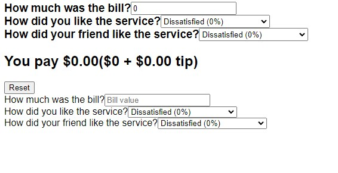

# Tip Calculator

## Table of contents

- [Overview](#overview)
  - [The challenge](#the-challenge)
  - [Screenshot](#screenshot)
  - [Links](#links)
- [My process](#my-process)
  - [Built with](#built-with)
  - [What I learned](#what-i-learned)
  - [Continued development](#continued-development)
- [Author](#author)

## Overview

### The challenge

Users should be able to:

- View the optimal layout for the app depending on their device's screen size
- Enter aa bill amount.
- Choose which tip percentage you wish to pay.
- Choose which tip percentage your friend wish to pay.
- A total is made from the bill and average tip amount.

### Screenshot

### Links

- Live Site URL: [View](https://tip-calculator57.netlify.app/)

## My process

- The `App` component is the main component that renders other components like `Bill`, `Tip`, `Output`, and `Reset`.
- State hooks like `useState` are used to manage state variables such as `bill`,` yourTip`, and` friendsTip`.
- The `Bill` component allows users to input the bill amount, updating the `bill` state accordingly.
- The `Tip` component provides dropdowns for selecting tip percentages based on different service experiences, updating` yourTip` and `friendsTip` states.
- The `Output` component calculates and displays the total bill including tips, while the `Reset` component resets all input values to zero when clicked.

### Built with

- Semantic HTML5 markup
- CSS custom properties
- Mobile-Responsive Design
- JavaScript - Scripting language
- [React](https://reactjs.org/) - JS library

### What I learned

This a test to see my knowledge of passing props between parent and child and usage of children.

### Continued development

maybe use later

## Author

- Website - [Cameron Howze](https://camkol.github.io/)
- Frontend Mentor - [@camkol](https://www.frontendmentor.io/profile/camkol)
- GitHub- [@camkol](https://github.com/camkol)
- LinkedIn - [@cameron-howze](https://www.linkedin.com/in/cameron-howze-28a646109/)
- E-Mail - [cameronhowze4@outlook.com](mailto:cameronhowze4@outlook.com)
